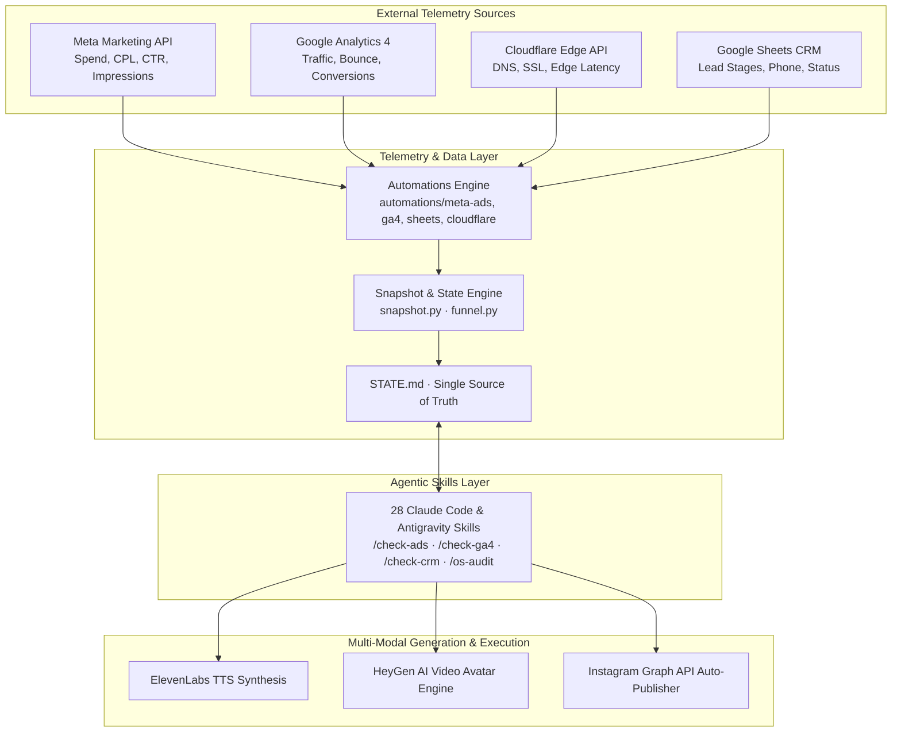

# Autonomous AI Operating System for Growth & BizOps (AIOS)

> An end-to-end autonomous business operating system designed for modern AI agencies, startups, and GTM teams. Connects multi-channel telemetry (**Meta Ads API**, **Google Analytics 4 Data API**, **Cloudflare Edge**, and **Google Sheets CRM**) with multi-modal generation pipelines (**ElevenLabs TTS**, **HeyGen Video AI**, and **GigaAM transcription**) and **28 custom agentic operational skills** for automated business auditing.

[](https://python.org)
[](https://developers.facebook.com)
[](https://analytics.google.com)
[](https://cloudflare.com)
[](https://elevenlabs.io)
[](https://heygen.com)
[](LICENSE)

---

## System Architecture



---

## Key Modules & Capabilities

### 1. 📊 Unified Business Telemetry (`automations/`)
- **Meta Marketing API (`meta-ads/`):** Programmatic ad account monitoring, spend auditing, cost-per-lead (CPL) tracking, and click-through rate (CTR) anomaly detection.
- **Google Analytics 4 Data API (`ga4/`):** Real-time visitor counts, traffic source attribution, conversion event tracking, and funnel stage drop-off analysis.
- **Google Sheets v4 API (`sheets/`):** Bidirectional CRM sync, lead deduplication, phone sanitization (E.164), and pipeline status updates.
- **Cloudflare Edge & DNS (`cloudflare/`):** Edge health checks, SSL certificate status, and traffic spike monitoring.

### 2. 🤖 28 Custom Operational Skills (`.claude/skills/`)
Custom agentic commands that allow AI assistants to inspect, audit, and operate the business:
- **Telemetry Skills:** `/check-ads` (Meta performance), `/check-ga4` (site analytics), `/check-crm` (uncontacted leads), `/check-cf` (edge status), `/check-full` (comprehensive audit).
- **Execution Skills:** `content-batch` (ad creative copy drafting), `ig-post` (Instagram publishing), `/grill-me` (deep requirement interview).
- **Maintenance & Drift Audit:** `/state-check` (verifies `STATE.md` against live APIs), `/os-audit` (system drift detection), `/level-up` (weekly automation review).

### 3. 🎙️ Multi-Modal Content & Generation Pipelines
- **Voice Synthesis (`elevenlabs_tts.py`):** Automated text-to-speech rendering utilizing configured voice profiles and stability parameters.
- **Avatar Video Generation (`heygen_tts.py`):** Programmatic HeyGen API integration rendering video ad creatives and founder avatars.
- **Speech-to-Text (`gigaam_transcribe.py`):** Audio transcription pipeline for call reviews and content capture.

### 4. 📈 State Machine & Funnel Engine
- **`snapshot.py`:** Structured state serializer aggregating metrics across all telemetry sources into timestamped JSON snapshots.
- **`funnel.py`:** Computes mathematical conversion efficiencies across each step of the customer acquisition funnel.
- **`STATE.md`:** The authoritative human-readable and machine-parsable operating document.

---

## Getting Started

### 1. Installation

```bash
git clone https://github.com/mradurdymyradov/autonomous-bizops-aios.git
cd autonomous-bizops-aios

python -m venv .venv
source .venv/bin/activate  # On Windows: .venv\Scripts\Activate.ps1
pip install -r requirements.txt
```

### 2. Environment Configuration

Copy the configuration template and fill in your API credentials:

```bash
cp .env.example .env
```

Supply your tokens for Meta, Google Cloud service account, Cloudflare, and ElevenLabs.

### 3. Running Telemetry Checks

```bash
# Check Meta Ads performance
python automations/meta-ads/check_ads.py

# Check Google Analytics 4 traffic
python automations/ga4/check_ga4.py

# Generate a unified business snapshot
python automations/snapshot.py
```

---

## Directory Structure

```text
autonomous-bizops-aios/
├── README.md                   # System documentation & architecture map
├── CLAUDE.md                   # Operating manual & agent routing table
├── AGENTS.md                   # Cross-agent execution standards
├── STATE.md                    # Canonical business state & metrics
├── LICENSE                     # MIT License
├── .env.example                # Documented configuration template
├── .claude/
│   └── skills/                 # 28 operational skills (/check-ads, /check-ga4, etc.)
├── automations/
│   ├── meta-ads/               # Meta Marketing API integration
│   ├── ga4/                    # Google Analytics 4 Data API
│   ├── sheets/                 # Google Sheets CRM synchronization
│   ├── cloudflare/             # Cloudflare DNS & edge telemetry
│   ├── ig-insights/            # Instagram Graph API analytics
│   ├── img-gen/                # Automated visual asset generation
│   ├── voice-clone/            # ElevenLabs TTS integration
│   ├── snapshot.py             # Telemetry snapshot serializer
│   └── funnel.py               # Mathematical funnel analysis
├── brand/                      # Content rules & brand design system
├── context/                    # Operating principles & strategic priorities
├── decisions/                  # Append-only architectural decision log
└── references/                 # API specifications & frameworks
```

---

## License

This project is licensed under the MIT License — see the [LICENSE](LICENSE) file for details.
